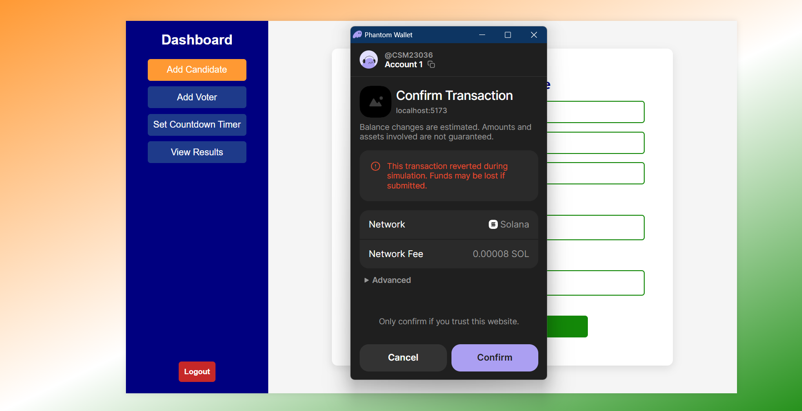

# Blockchain Based Voting System

A secure, transparent, and decentralized voting system built with modern web technologies and blockchain infrastructure. This system combines MERN stack for the web application, Flask for biometric authentication, and Solana blockchain for secure, low-cost transactions with voter privacy protection.

## 🚀 Features

- **Secure Blockchain Voting**: Utilizes Solana blockchain for immutable and transparent vote recording
- **Biometric Authentication**: Face recognition system for voter verification
- **Privacy Protection**: Voter identity protection through cryptographic hashing
- **Real-time Updates**: WebSocket integration for live voting time broadcasts
- **Low Transaction Fees**: Solana blockchain ensures minimal transaction costs
- **Decentralized Architecture**: Eliminates single points of failure
- **User-friendly Interface**: Modern React-based frontend for easy interaction

## 🛠️ Technology Stack

### Frontend & Backend
- **Frontend**: React.js, HTML5, CSS3, JavaScript
- **Backend**: Node.js, Express.js
- **Database**: MongoDB
- **Real-time Communication**: WebSocket

### Blockchain & Smart Contracts
- **Blockchain**: Solana
- **Smart Contract Language**: Rust
- **Development Environment**: Solana Playground
- **Transaction Explorer**: Solana Explorer

### Biometric Authentication
- **Framework**: Flask (Python)
- **Face Recognition**: Computer Vision libraries
- **Environment**: Python virtual environment

## 📁 Project Structure
### E_Voting_System_blockchain
- **client**: React frontend application
- **server**: Node.js backend server
- **face_server**: Flask face recognition server
- **docs**: Some other resouces
- **README.md**

  

## 📸 Screenshots

### Admin/Election Commission

*Overview of the blockchain voting system admin area*

### Voter Registration

*Face recognition-based voter registration interface*

### Voting Interface

*Main voting dashboard with candidate selection*

### Blockchain Transactions

*Transaction payment through Phantom wallet*

### Real-time Results 

* Voting results refresh every minute*

## 🔐 Security Features

### Privacy Protection
- **Hash-based Anonymity**: Voter identities are protected through cryptographic hashing
- **Biometric Verification**: Face recognition ensures only authorized voters can participate
- **Blockchain Immutability**: All votes are permanently recorded and tamper-proof

### Transaction Security
- **Smart Contract Validation**: Rust-based smart contracts ensure vote integrity
- **Low-cost Transactions**: Solana's efficient consensus mechanism reduces fees
- **Transparent Auditing**: All transactions visible on Solana Explorer

## 📊 Monitoring & Analytics

- **Solana Explorer**: Monitor all blockchain transactions
- **Real-time Dashboard**: Track voting progress and participation
- **Transaction Logs**: Detailed audit trail for all voting activities

## 🤝 Contributing

1. Fork the repository
2. Create a feature branch (`git checkout -b feature/amazing-feature`)
3. Commit your changes (`git commit -m 'Add some amazing feature'`)
4. Push to the branch (`git push origin feature/amazing-feature`)
5. Open a Pull Request

## 🙏 Acknowledgments

- Solana Foundation for blockchain infrastructure
- MERN stack community for web development resources
- Flask community for Python web framework support
- Open source contributors for various libraries and tools

## 📞 Support

For support and questions:
- Create an issue in this repository
- Contact: sumsumgogoi51@gmail.com
- Portfolio: https://sumsum-gogoi.vercel.app/

---

**Note**: This is a demonstration project for educational purposes. Ensure proper security audits before deploying in production environments.

